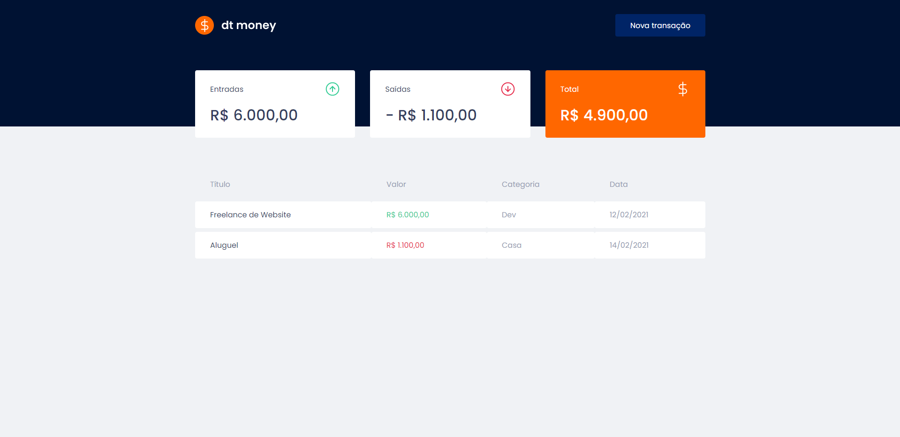

# dt money financial app

 

## About dt money

is a simple and effective alternative to manage your finances, allowing the registration of entries, exits and the organization of them in categories.
 

## Technologies

Technologies and tools used in the development of the project:

- [React](https://reactjs.org/)
- [TypeScript](https://www.typescriptlang.org/)
- [Styled Components](https://styled-components.com/)
- [MirageJS](https://miragejs.com/)
- [Axios](https://github.com/axios/axios)
- [Polished](https://polished.js.org/)
 

## Licença

 

---
Made with 💖 by [**mmarinhomac**](https://github.com/mmarinhomac)
